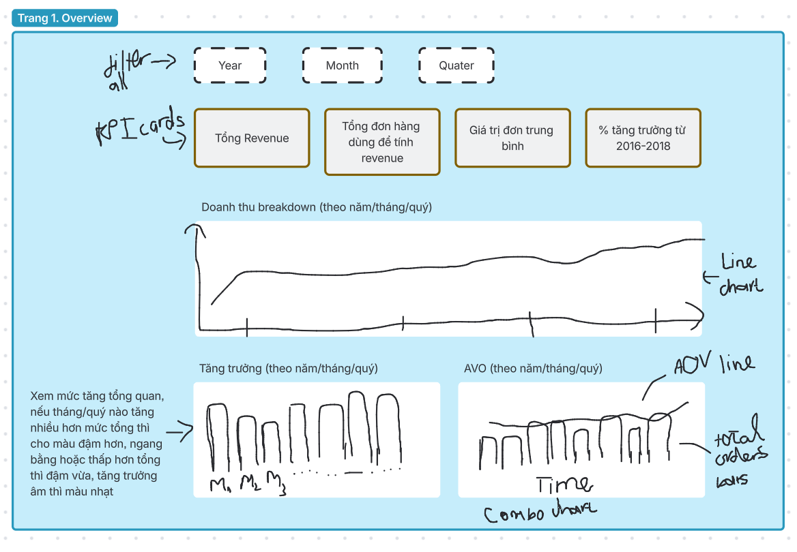
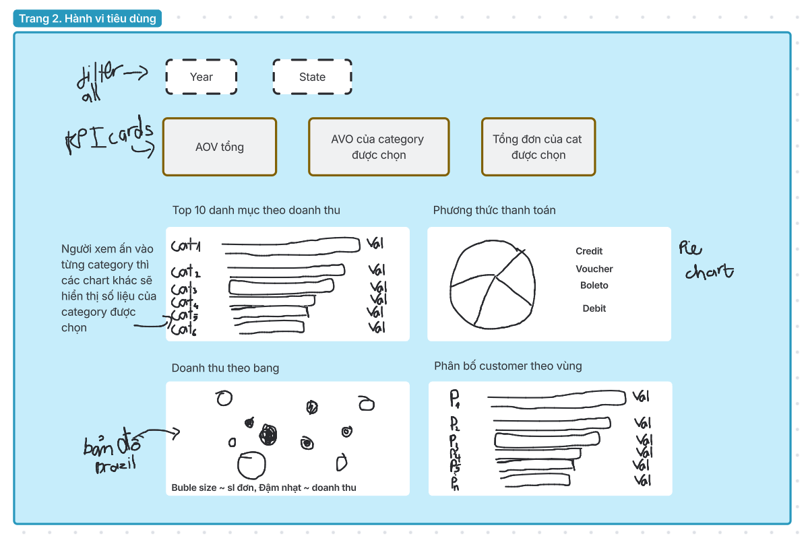

# Project 1 - Phan tich du lieu ban hang TMDT

## Cau truc thu muc

- data/raw          -- Du lieu goc (CSV)
- data/processed    -- Du lieu da xu ly (xem Drive)
- data/external     -- Du lieu ngoai
- notebooks/        -- Jupyter notebooks
- reports/figures   -- Bieu do output

## Thanh vien & vai tro
| Thành viên | Vai trò | Phụ trách chính |
| :--- | :--- | :--- |
| **Trang** | Tech Lead | Kick-off, lập kế hoạch, bài thuyết trình |
| **Duy Tuân** | AI Engineer (Pipeline) | Thu thập dữ liệu, pipeline, lưu trữ (up tài liệu lên github) |
| **Tấn Dũng** | AI Engineer (Data analysis) | EDA, xây dựng dashboard |
| **Tâm Trần** | AI Engineer (Data cleaning) | Làm sạch dữ liệu, lấy insights |
| **Hoàng Nhân** | QA / Reviewer | Kiểm tra chất lượng dữ liệu & insight |

## Data

Raw data: co trong repo tai data/raw/

Processed data (xlsx): https://drive.google.com/drive/folders/1x0ueYwYFo9hkATUUp-jIzDMXUY3lxe1d?usp=sharing

